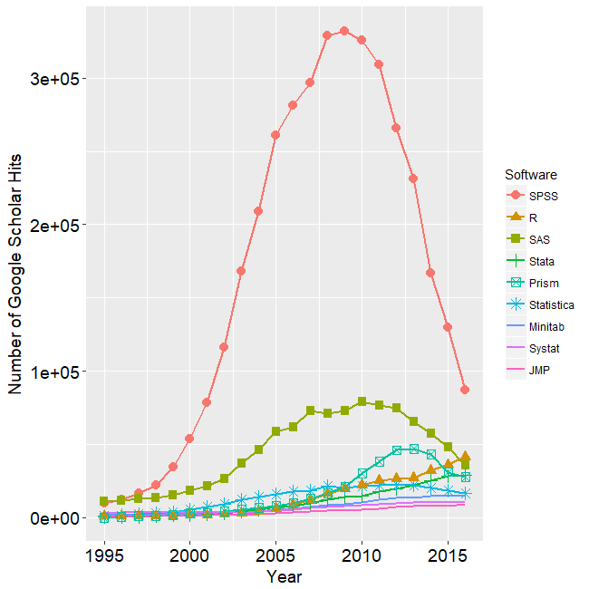
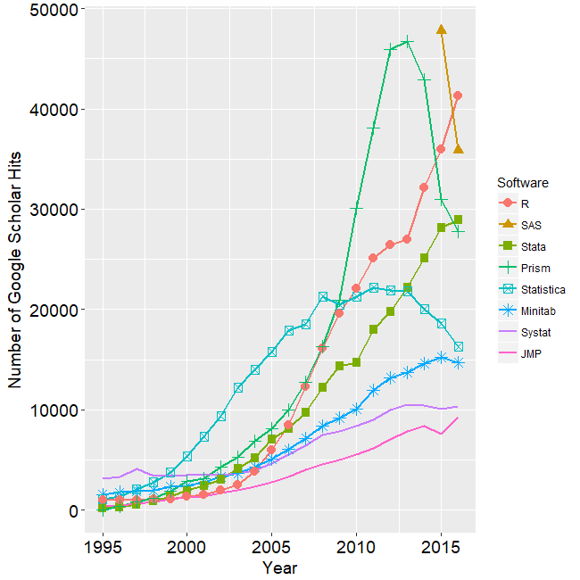
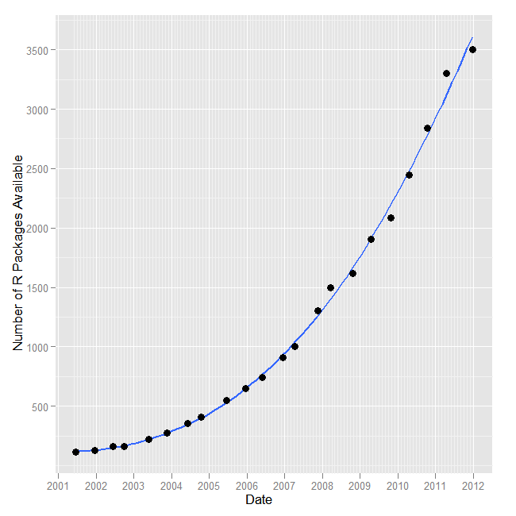
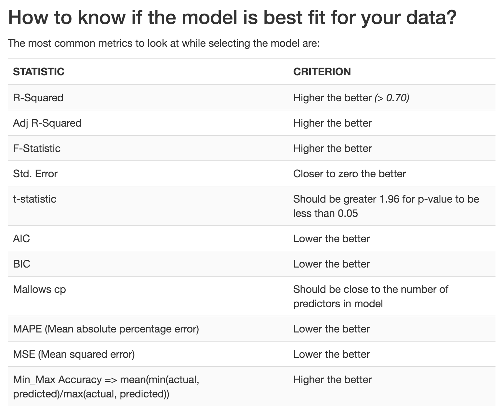

R Programming for Beginners
========================================================
author: Jeho Park
date: Sep. 19, 2019
transition: none
autosize: true

## Murty Sunak Quantitative and Computing Lab
### Workshop Series: Coding - Level 2


Some Housekeeping Stuff
========================================================
- **Slides** at http://rpubs.com/jehopark/r-programming-beginner
- **Files** at https://github.com/CMC-QCL/r-programming-beginner


This workshop is...
========================================================
* about R's programming aspects.
  - Designed to help you start R programming.
  - Designed to help you recall your memory of R programming.
* not about Statistics.
  - Assuming that you already have a basic knowledge of Statistics.

Agenda
========================================================
* Introduction to R 
* Examples 
* R Objects 
* Using R for statistical analysis: Linear regression

Introduction to R
========================================================
* What is R?
* What is not R?
* Then Why R?
* Asking questions
* What is RStudio?
* Let's run R/RStudio!
* What Can We Do with RStudio?
* Look Ma, R can do MATH!
* Even more Math!

More about R
========================================================
* Some R Vocabulary.
* Some General Stuff and Workspace of R
* R Objects (Vector, List, Data Frame, Factor, Function)
* Using R: Linear Regression

What is R?
========================================================
* R is a statical programming language/environment.
* R is open source/free.
* R is widely used/prefered.
* R is cross-platform.
* R is hard to learn (really?).

What is not R?
========================================================
* S: R's ancestor
* S-Plus: Commercial; modern implementation of S
* SAS: Commercial; widely used in the commercial analytics.  
* SPSS: Commercial; easy to use; widely used in Social Science.
* MATLAB: Commercial; can do some Stats. 
* Python: Also can do some Stats; good in text data manipulation.


Then Why R?
========================================================
* __R is a popular statitical tool__
* R has tons of user generated libraries/packages
* R code is easily shared with others
* R is constantly improving

***



Then Why R?
========================================================
After SPSS and SAS:<br>


Then Why R?
========================================================
* R is a popular statitical tool
* __R has tons of user generated libraries/packages__
* R code is easily shared with others
* R is constantly improved (open source)

***



Get Help
========================================================
* Stack Overflow: http://stackoverflow.com/questions/tagged/r
* Cross-Validated: the statistics Q&A site http://stats.stackexchange.com/
* Google!
* Contact QCL: qcl@cmc.edu; we are located underneath the Cube!

What is RStudio?
========================================================
* Integrated Development Environment for R
* Nice combination of GUI and CLI
* Free and commercial version
* 4 main windows, tabs, etc
* Version control: Git and VPN
* Debugging 
* Documentation: R Markdown
  - install.packages("rmarkdown")
  - http://rmarkdown.rstudio.com/
* Presentation slides: R Presentation (this one!)

Check Point 1: Environment Check
========================================================
* R
* RStudio

What Can We Do with RStudio?
========================================================
## RStudio Introduction


Look Ma, R can do Math! 
========================================================

```r
1+1
```


```r
2+runif(1,min=0,max=1)
```


```r
3^2
```


```r
3*3
```


```r
sqrt(3*3) # square root function
```


```r
# comments are preceded by hash sign sqrt(3*3)
```

Even More Math! 
========================================================
* R can take integrals and derivatives, for example:

Numerical Integral of

$\displaystyle\int_0^{\infty} \frac{1}{(x+1)\sqrt{x}}dx$ 


```r
integrand <- function(x) {1/((x+1)*sqrt(x))} ## define the integrated function
```

```r
integrate(integrand, lower=0, upper=Inf) ## integrate the function from 0 to infinity
```

```
3.141593 with absolute error < 2.7e-05
```


Some R Vocabulary
========================================================
* **packages** are add on features to R  include data, new functions and methods, and extended capabilities. Think of them as ``apps'' on your phone. We've already installed several!
* **console** is the main window of R where you enter commands
* **workspace** is the working memory of R where all objects are stored
* **script** is where you store commands to be run in the terminal later, like syntax files in SPSS or .do files in Stata
* **function** is a set of commands doing something to R object(s) by getting inputs, do work, and return outputs. 


Some Gene-R-al Stuff
========================================================

```r
demo() # display available demos
```

```r
demo(graphics) # try graphics demo
```

```r
library() # show available packages on the computer
```

```r
search() # show loaded packages
```

```r
?hist # search for the usage of hist function
```


```r
??histogram # search for package documents containing the word "histogram"
```

Workspace of R
========================================================

R workspace stores objects like vectors, datasets and functions in memory (the available space for calculation is limited to the size of the RAM).


```r
a <- 5 # notice a in your Environment window
```


```r
A <- "text" 
```


```r
a
A
ls()
print(c(a,A))
print(a,A)
```

Basic R Objects: Vectors
========================================================
Vectors are array objects of the __same type__ data elements.


```r
class(a)
```

```r
class(A)
```

```r
B <- c(a,A) # concatenation
```

```r
print(B)
```

```r
class(B) # why?
```

Basic R Objects: Vectors (cont.)
========================================================
R has five basic or “atomic” classes of objects: 
* character
* numeric (real numbers) 
* integer
* complex
* logical (True/False)

A vector contains a set of data in any one of the atomic classes.

Basic R Objects: Lists
========================================================
List are objects that can store __different types__ of vectors. 

```r
aList <- list(name=c("Joseph"), married=T, kids=2)
aList
aList$kids <- aList$kids+1
aList$kids
aList2 <- list(numeric_data=a,character_data=A)
aList2
allList <- list(aList, aList2)
allList
```

Basic R Objects: Data frames
========================================================
### Data frames are used for storing data tables. 
### It is a __list of vectors of equal length__. 

```r
n <- c(2, 3, 5) # a vector 
s <- c("aa", "bb", "cc") # a vector
b <- c(TRUE, FALSE, TRUE) # a vector
df <- data.frame(n, s, b) # a data frame
df
mtcars # a built-in (attached) data frame
mtcars$mpg
```

Basic R Objects: Data frames (cont.)
========================================================
### Data frames are used for storing data tables. 
### It is a __list of vectors of equal length__. 

```r
df1 <- data.frame(y1=rnorm(100),y2=rnorm(100), y3=rnorm(100))
head(df1) # display first few lines of data
names(df1) # display column names
summary(df1) # output depends on the data types
plot(df1)
```

```r
df2 <- read.table("https://s3.amazonaws.com/assets.datacamp.com/blog_assets/test.txt", 
                 header = FALSE)
df2
```

Subsseting
=========================
There are three operators used to extract subsets of R objects.
* [ always returns an object of the same class as the original; can be used to select more than one element.
* [[ is used to extract elements of a list or a data frame; it can only be used to extract a single element.
* $ is used to extract elements of a list or data frame by name.

[Q] What happens when [ is applied to a list?

Subsetting (cont.)
==========================

```r
x <- c("a", "b", "c", "c", "d", "a")
x[1]
x[1:4]
x[x > "a"] 
u <- x > "a" # what's u here?
u
x[u] # subsetting using a boolean vector
y <- list(foo=x, bar=x[u])
y
y[[1]]
y[1]
y$bar
```
R Objects: Factor
========================================================
* Factors are a special compoud object used to represent __categorical data__ such as gender, social class, etc.
* Factors have 'levels' attribute. They may be nominal or ordered.

```r
v <- c("a","b","c","c","b")
x <- factor(v) # turn the character vector into a factor object
z <- factor(v, ordered = TRUE) # ordered factor
x
z
table(x)
```

R Objects: Functions
=============================

```r
fun <- function(a,b) {
  a*b
}

fun   
fun(2,3) # a function call
```


Linear Regression
========================================================
> Linear regression is used to predict the value of an outcome variable Y based on one or more input predictor variables X. The aim is to establish a linear relationship (a mathematical formula) between the predictor variable(s) and the response variable, so that, we can use this formula to estimate the value of the response Y, when only the predictors (Xs) values are known.

$$
Y = \beta_0 + \beta_1 X + ε
$$

where $Y$ is the response, $X$ is the predictor, and $ε$ is a random error term.

The linear model describes a straight line relationship between the response variable Y and predictor X.


Linear Regression (cont.)
========================================================
__Data and Method__

Consider a set of paired observations of speed and stopping distance of cars. Will there be a linear relation between stopping distance and speed of a car? Let's find out.

We will use "cars" dataset which is already installed.

Try ?cars

First we will create a scatter plot from the cars data. Then we will try fitting the relation using the lm function (fitting linear models) in stats package.

Linear Regression (cont.)
========================================================
__Graphical Analysis__ 

Let's first visually check the relatioship between two variables, speed and dist.

```r
# [Q] what kind of plot shows realtionship between two variables?
```

Linear Regression (cont.)
========================================================
__Graphical Analysis__ 

Let's first visually check the relatioship between two variables, speed and dist.

```r
plot(x=cars$speed, y=cars$dist) #simple scatterplot
scatter.smooth(x=cars$speed, y=cars$dist, main="Dist ~ Speed")  # scatterplot with smooth curve
```

Linear Regression (cont.)
========================================================
__Linear Model__ 

The R function for linear regression is lm (i.e., linear model). It takes two arguments: formula and data.

The formula that specifies a simple linear regression model $dist = \beta_1 + \beta_1 speed + ε$ is simply

**dist ∼ speed**


```r
lm(dist ~ speed, data=cars)
```
__The function lm displays only the estimated coefficients, but the object returned by lm contains much more information.__

Linear Regression (cont.)
========================================================
__Fitting the model__ 

Let's save the result:

```r
linearmodel <- lm(dist ~ speed, data=cars) #save the result
intercept <- linearmodel$coefficients[[1]]
slope <- linearmodel$coefficients[[2]]
```

Let's plot the line:

```r
plot(cars, main="dist = -17.579 + 3.932 speed", 
     xlim=c(0, 25), ylim=c(-10,130)) # simple scatter plot
abline(intercept, slope) # adding a line manually
```

Linear Regression (cont.)
========================================================
__Linear Regression Diagnostic__

We want to know how good this model we just found is. 
- Is it statistically significant? 
- How good the model predict the value of response variable w.r.t a new value of the predictor variable. 
- How can we check?


```r
# summary of the model statistics
```


Linear Regression (cont.)
========================================================
__Linear Regression Diagnostic__

We want to know how good this model we just found is. 
- Is it statistically significant? 
- How good the model predict the value of response variable w.r.t a new value of the predictor variable. 
- How can we check?


```r
summary(linearmodel) 
```
Look at p-Values and r-squared for now. 

Linear Regression (cont.)
========================================================
__Linear Regression Diagnostic__

> In Linear Regression, the Null Hypothesis is that the coefficients associated with the variables is equal to zero (no effect). With the p-Value < 0.05, we can reject the null hypothesis. 

> R-squared value tells you that how good the model represent the actual population. It's called a goodness-of-fit measure for linear regression models. This statistic indicates the percentage of the variance in the dependent variable that the independent variables explain collectively.
  
Linear Regression (cont.)
========================================================
__The most common metrics to check the model's quality__




That's it! (for now)
========================================================
> Useful links:
> 
> - R tutorial sites: http://jaredknowles.com/r-bootcamp/ and http://adv-r.had.co.nz/
> - R search site: http://rseek.org
> - R Markdown cheat sheet: http://shiny.rstudio.com/articles/rm-cheatsheet.html

**(Adapted from several publicly available resources such as 1) the R-Bootcamp by Jared Knowles: http://jaredknowles.com/r-bootcamp/, 2) Advanced R by Hadley Wickham: http://adv-r.had.co.nz</small>
<small>(Slides are made with the R Presentations tool in RStudio)**
